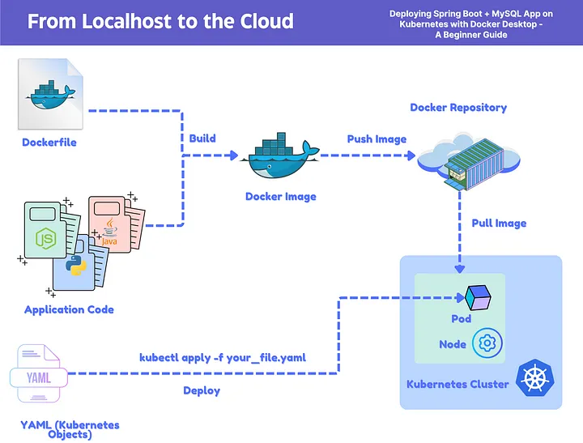
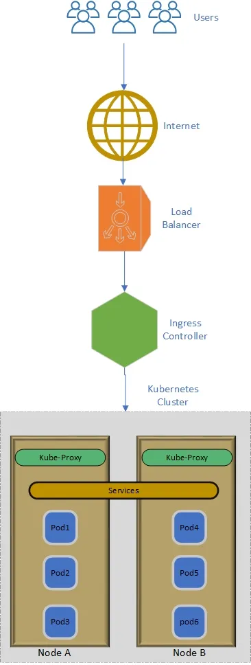

# Day 1 : Kubernetes Basic

**Request Flow from the internet to Pods of Kubernetes**

[https://medium.com/@Techie1/how-user-request-flow-to-pod-running-inside-k8s-cluster-b18e200318dc#:~:text=The forward flow of a,back to the user's device](https://medium.com/@Techie1/how-user-request-flow-to-pod-running-inside-k8s-cluster-b18e200318dc#:~:text=The%20forward%20flow%20of%20a,back%20to%20the%20user's%20device).

- Node means virtual machine
- pod means an instance inside the virtual machine. (there can be 3 individual os/system inside the single node.)

**Kind of Components**

1. Namespace
2. Configmap
3. Secret
4. Deployment
5. Service
6. Ingress
7. Persistent Volume
8. Persistent Volume Claim
9. Daemon sets
10. Cron Jobs
11. Horizontal Pod Autoscalers
12. Vertical Pod Autoscalers
