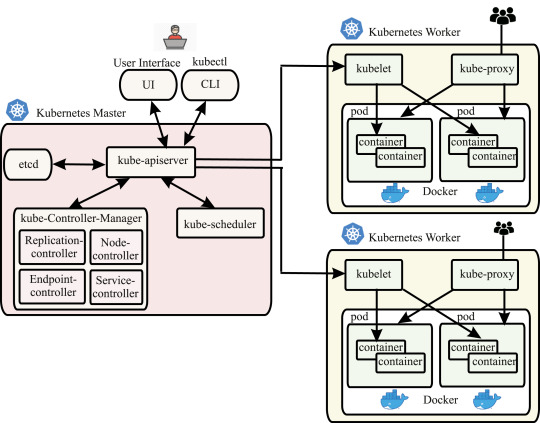
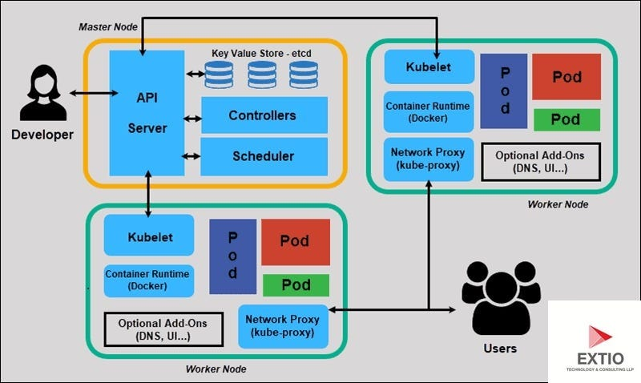
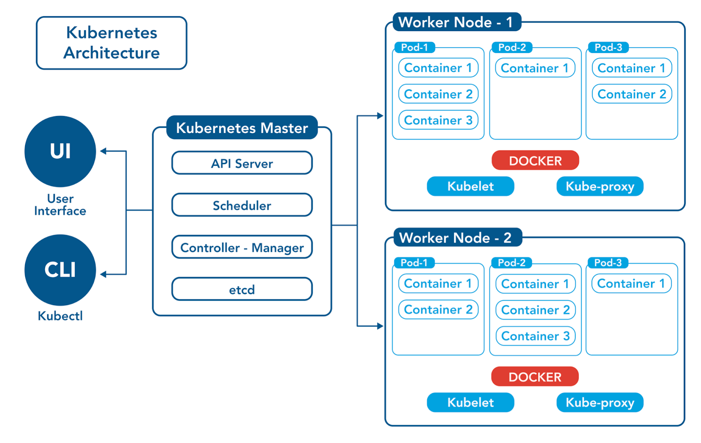
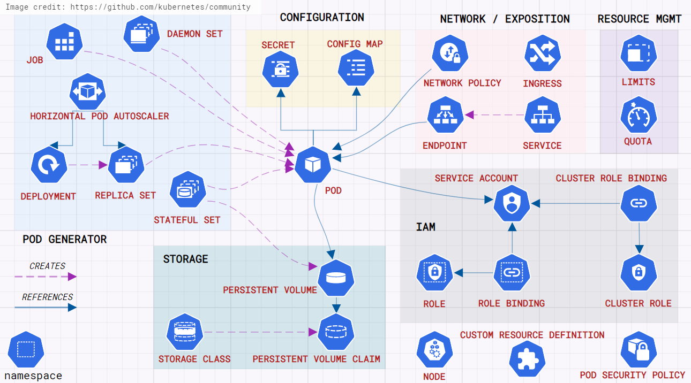

# Growing Together

## Commands

```
#Applying configuration
kubectl apply -f <filename>

#deleting configuration
kubectl delete -f <filename>

# restart the kind
kubectl rollout restart <resource>/<name>[optional] -n <namespace>
kubectl rollout restart deployment -n dev
kubectl rollout restart deployment/gwot -n dev
kubectl rollout restart daemonset -n dev
```

## Readings

- [User Management](https://medium.com/@muppedaanvesh/a-hand-on-guide-to-kubernetes-rbac-with-a-user-creation-%EF%B8%8F-1ad9aa3cafb1)
- [User Request Flow](https://medium.com/@Techie1/how-user-request-flow-to-pod-running-inside-k8s-cluster-b18e200318dc#:~:text=The%20forward%20flow%20of%20a,back%20to%20the%20user's%20device)

## Day 1:Kubernetes Basic

  


### Notes

Node means virtual machine

pod means an instance inside the virtual machine. (there can be 3 individual os/system inside the single node.)

**Kind of Components**

1.  Namespace
2.  Configmap
3.  Secret
4.  Deployment
5.  Service
6.  Ingress
7.  Persistent Volume
8.  Persistent Volume Claim
9.  Daemon sets
10. Cron Jobs
11. Horizontal Pod Autoscalers
12. Vertical Pod Autoscalers

## Day 2 : Kubernetes architecture and deployment

  
  
  


### Notes

- https://www.youtube.com/watch?v=6_gMoe7Ik8k&list=PLl4APkPHzsUUOkOv3i62UidrLmSB8DcGC&index=1
